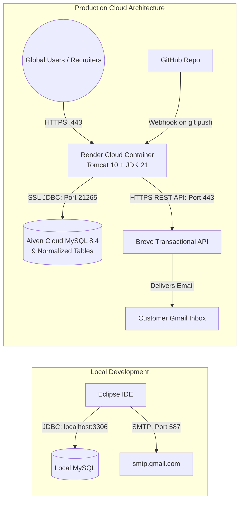
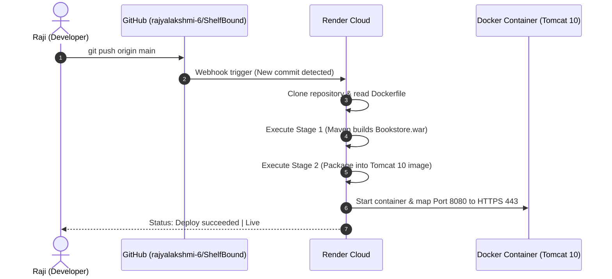
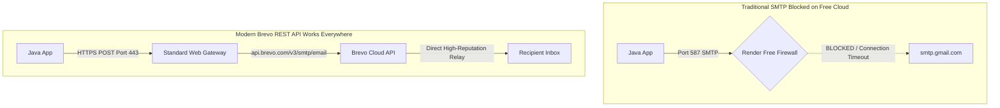
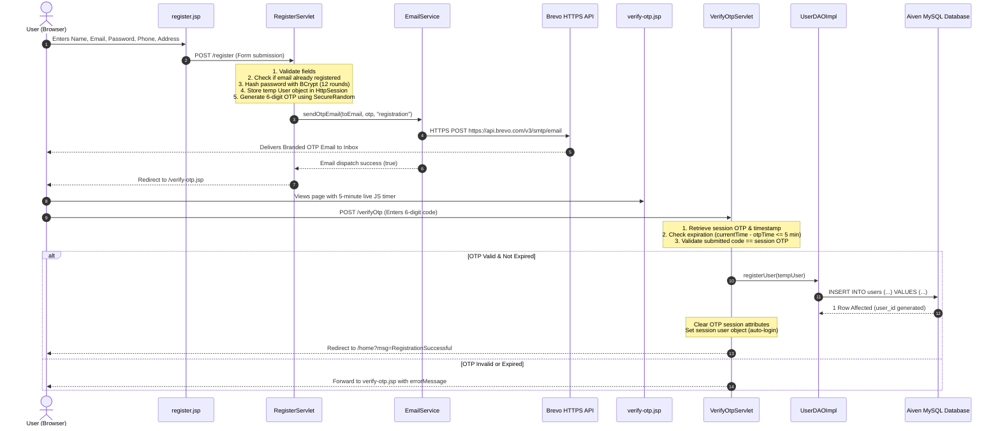

# 📘 ShelfBound: Complete Production Architecture & Cloud Engineering Guide
> **Personal Master Reference & Interview Preparation Blueprint**  
> *Author:* Rajyalakshmi Devarala | *Project:* ShelfBound Full-Stack Bookstore  
> *Deployment:* Apache Tomcat 10.1 on Docker & Render Cloud · Aiven Cloud MySQL 8.4 · Brevo REST API  

---

## 📑 Table of Contents
1. [The Big Picture: Local Development vs. Cloud Production](#1-the-big-picture-local-development-vs-cloud-production)
2. [Cloud Database Architecture: Aiven MySQL 8.4 Migration](#2-cloud-database-architecture-aiven-mysql-84-migration)
3. [Containerization: Why & How We Built the Multi-Stage Dockerfile](#3-containerization-why--how-we-built-the-multi-stage-dockerfile)
4. [Cloud Hosting: Why Render & Platform Alternatives Analysis](#4-cloud-hosting-why-render--platform-alternatives-analysis)
5. [The Cloud Email Problem: Why Brevo (Sendinblue) Solved It](#5-the-cloud-email-problem-why-brevo-sendinblue-solved-it)
6. [Security & Secrets Management: GitHub Push Protection & Env Vars](#6-security--secrets-management-github-push-protection--env-vars)
7. [Deep-Dive: End-to-End Email & OTP Verification Lifecycle](#7-deep-dive-end-to-end-email--otp-verification-lifecycle)
8. [File-by-File Technical Breakdown](#8-file-by-file-technical-breakdown)
9. [Interview Q&A Cheat Sheet: Technical Defense](#9-interview-qa-cheat-sheet-technical-defense)

---

## 1. The Big Picture: Local Development vs. Cloud Production

### 1.1 The Starting Point (Local Machine)
When developing inside Eclipse on your local laptop:
- **Server:** Apache Tomcat 10 was managed locally through the Eclipse Server adapter.
- **Database:** MySQL Server 8.0 ran on your laptop's loopback address (`localhost:3306`).
- **Network:** Outbound network calls used your home/college residential Wi-Fi, allowing port `587` to talk directly to Google's `smtp.gmail.com`.
- **Packaging:** Eclipse dynamically published compiled `.class` files into a temporary workspace directory (`.metadata/.plugins/...`).

### 1.2 The Production Goal (Global Cloud)
To make the application publicly accessible 24/7 to recruiters anywhere in the world without keeping your laptop turned on:
1. **Public URL:** The website must be reachable over standard HTTPS (`https://shelfbound-bookstore.onrender.com`).
2. **Cloud Database:** The data must live in an always-online cloud database accessible by both local Eclipse and the remote cloud container.
3. **Automated CI/CD:** Any code pushed via `git push origin main` must be compiled, tested, packaged into a Docker container, and deployed automatically.
4. **Resilient Transactional Emails:** OTPs, receipts, and order updates must reliably reach user inboxes despite strict cloud firewall policies.



---

## 2. Cloud Database Architecture: Aiven MySQL 8.4 Migration

### 2.1 Why `localhost:3306` Fails in the Cloud
A cloud container running on Render has its own isolated file system and network. If the code tries to connect to `localhost:3306`, it searches *inside the container itself*, finds no MySQL server installed there, and crashes with `CommunicationsException: Connection refused`. The database **must** live on an independent, persistent cloud host.

### 2.2 Why We Chose Aiven over Alternatives
| Provider | Free Tier Policy | Why We Picked or Avoided |
| :--- | :--- | :--- |
| **AWS RDS** | 12 months free tier, but **requires Credit Card**; charges high fees if limits exceeded. | Avoided (requires credit card & accidental bill risk). |
| **PlanetScale** | No free tier anymore (discontinued in 2024). | Avoided. |
| **Supabase / Neon** | Great free tiers, but **PostgreSQL only** (requires rewriting all MySQL syntax & queries). | Avoided (would break existing MySQL queries). |
| **Clever Cloud** | Free MySQL, but limited to only 10MB storage and drops connections frequently. | Avoided. |
| **Aiven Cloud** | **Genuine MySQL 8.4, 100% Free, NO credit card required**, supports 9 tables, SSL encryption, and high availability. | **WINNER (Selected)** |

### 2.3 Migration Steps & The PowerShell `<` Syntax Trap
1. **Schema & Data Export:** We dumped all 9 tables (`admin`, `categories`, `books`, `cart`, `wishlist`, `orders`, `order_items`, `contact_messages`, `offers`) along with BCrypt hashes and relationships into [`shelfbound_schema.sql`](file:///C:/JEE_practice/workspace/Bookstore/shelfbound_schema.sql).
2. **The PowerShell Pitfall:** In traditional Unix/Linux shells and Windows Command Prompt (`cmd.exe`), you import SQL scripts using input redirection:
   ```bash
   mysql -u user -p dbname < schema.sql
   ```
   However, Windows **PowerShell** throws this error:
   ```text
   The '<' operator is reserved for future use.
   FullyQualifiedErrorId : RedirectionNotSupported
   ```
3. **The Solution:** In PowerShell, piping must be used instead of `<`:
   ```powershell
   Get-Content -Raw "shelfbound_schema.sql" | & "C:\Program Files\MySQL\MySQL Server 8.0\bin\mysql.exe" -h mysql-5c12919-devaralarajyalakshmi265-47ce.l.aivencloud.com -P 21265 -u avnadmin -p defaultdb
   ```

### 2.4 Code Adaptation: Dynamic Database Loader in `DBConnection.java`
To make the application run seamlessly both on your local laptop (pointing to local MySQL) and on Render (pointing to Aiven Cloud), [`DBConnection.java`](file:///C:/JEE_practice/workspace/Bookstore/src/main/java/com/shelfbound/connection/DBConnection.java) was upgraded with dynamic environment variable detection:

```java
// Checks for Cloud Environment Variables first, falls back to local machine
String envUrl = System.getenv("DB_URL");
String envUser = System.getenv("DB_USER");
String envPass = System.getenv("DB_PASSWORD");

if (envUrl != null && !envUrl.trim().isEmpty()) {
    url = envUrl.trim();
    user = (envUser != null) ? envUser.trim() : "";
    password = (envPass != null) ? envPass.trim() : "";
} else {
    // Local fallback for Eclipse development
    url = "jdbc:mysql://localhost:3306/shelfbound?useSSL=false&allowPublicKeyRetrieval=true";
    user = "root";
    password = "your_local_password";
}
```

---

## 3. Containerization: Why & How We Built the Multi-Stage Dockerfile

### 3.1 Why Do We Need Docker?
Traditional PaaS hosts (like Vercel, Netlify, or basic Heroku) are built for Node.js, Python, or static HTML. They **do not have Apache Tomcat or the Java 21 JDK installed**. 

**Docker solves this by packaging the entire computer environment:**
- Operating System: Debian Linux
- Runtime: Eclipse Temurin OpenJDK 21
- Web Server: Apache Tomcat 10.1
- Application: `Bookstore.war` deployed as `ROOT.war`

Whatever runs inside this Docker container runs **identically** on Render, AWS, your laptop, or any server in the world.

### 3.2 The Multi-Stage `Dockerfile` Explained Line-by-Line

```dockerfile
# ====================================================
# Stage 1: Build the WAR with Maven
# ====================================================
FROM maven:3.9-eclipse-temurin-21 AS build
WORKDIR /app

# Step A: Cache dependencies so subsequent builds take seconds
COPY pom.xml .
RUN mvn dependency:go-offline -B || true

# Step B: Copy source code and build the production WAR
COPY src ./src
RUN mvn clean package -DskipTests

# ====================================================
# Stage 2: Production Apache Tomcat 10 on JDK 21
# ====================================================
FROM tomcat:10.1-jdk21-temurin

# Step C: Clean up default Tomcat apps (examples, manager, docs)
RUN rm -rf /usr/local/tomcat/webapps/*

# Step D: Deploy Bookstore.war as ROOT.war (CRITICAL STEP!)
COPY --from=build /app/target/Bookstore.war /usr/local/tomcat/webapps/ROOT.war

# Step E: Expose standard HTTP port
EXPOSE 8080

# Step F: Run Tomcat in the foreground
CMD ["catalina.sh", "run"]
```

> [!IMPORTANT]
> **Why deploy as `ROOT.war` instead of `Bookstore.war`?**  
> In Apache Tomcat:
> - If you name the WAR `Bookstore.war`, Tomcat mounts it at `https://yourdomain.com/Bookstore/...`. Every URL requires `/Bookstore`.
> - If you name the WAR `ROOT.war` (all uppercase), Tomcat mounts it at the **domain root (`/`)**.
> - Therefore, `request.getContextPath()` becomes `""` (empty string), and URLs like `/home`, `/books`, `/cart`, and `/adminLogin` resolve cleanly at `https://shelfbound-bookstore.onrender.com/`.

---

## 4. Cloud Hosting: Why Render & Platform Alternatives Analysis

### 4.1 Platform Comparison
| Cloud Host | Free Tier | Docker Support | Native Tomcat Support | Credit Card Needed? | Verdict |
| :--- | :--- | :--- | :--- | :--- | :--- |
| **Vercel / Netlify** | Yes | No | No (Node.js/Frontend only) | No | ❌ Incompatible with Java Servlets. |
| **Heroku** | No | Yes | Via Buildpack | Yes (Paid only) | ❌ Free tier killed in 2022. |
| **AWS Elastic Beanstalk** | 12 mo. | Yes | Yes | **Yes (Risky bills)** | ❌ Steep learning curve; credit card mandatory. |
| **Railway** | Trial only | Yes | Yes | Yes (Expired after $5) | ❌ Temporary trial. |
| **Render** | **Yes (Free forever)** | **Yes (Docker)** | **Yes (Via Dockerfile)** | **NO (Zero cost)** | ✅ **Selected** |

### 4.2 How Render's Automated CI/CD Works


### 4.3 Understanding the Free Tier "Cold Start"
- Render puts free web services to sleep after **15 minutes of zero traffic** to save server energy.
- When someone visits `https://shelfbound-bookstore.onrender.com` after it has gone to sleep, Render boots up the container.
- This first boot takes **30–50 seconds** (the "cold start"). Once awake, the application responds instantly to all clicks!

---

## 5. The Cloud Email Problem: Why Brevo (Sendinblue) Solved It

### 5.1 Why Local Eclipse Sent Emails, but Render Failed
This was one of the most important lessons in cloud backend engineering:

1. **The Local Reality:** On your home Wi-Fi, your ISP allows port `587`. Google recognizes your home IP address. `smtp.gmail.com` connects cleanly.
2. **The Cloud Firewall Reality:** On Render (and AWS/GCP/DigitalOcean):
   - **Render Free Tier blocks outbound connections on ports 25, 465, and 587.** This is an industry-standard anti-abuse policy to prevent spammers from spinning up free containers to blast millions of malicious phishing emails.
   - Even if port 587 was open, Google's automated security monitors detect that login attempts are coming from a **Singapore datacenter server**, flagging it as an unauthorized intruder and rejecting the credentials.

### 5.2 The Breakthrough: HTTP REST API vs. Raw SMTP
Instead of using raw SMTP over port 587, enterprise applications send transactional emails over **HTTPS (Port 443)** using a REST API. 
* **Port 443 is standard secure web traffic — cloud hosts NEVER block port 443.**



### 5.3 Why Brevo vs. Resend or SendGrid?
* **SendGrid:** Requires a corporate email address and custom DNS domain verification; bans personal accounts.
* **Resend:** Excellent API, but on their free tier you can only send emails to *your own email address* unless you purchase a custom domain name (e.g. `@shelfbound.com`) and configure DNS TXT/MX records.
* **Brevo (Winner):**
  - **100% Free forever (300 emails/day).**
  - **No custom domain required:** Allows you to verify your personal Gmail (`devaralarajyalakshmi265@gmail.com`) as the verified sender.
  - Generates an API key (`xkeysib-...`) that works immediately.

### 5.4 What was the "MCP Server API Key" Toggle?
When creating an API key on Brevo, there is an option: *"Create MCP server API key"*.
* **MCP (Model Context Protocol)** is a standard designed for AI agents (like Claude Desktop or Cursor) to read and manage your Brevo campaigns and contacts.
* For ShelfBound, we needed a **Standard REST API key** for our Java backend to send transactional emails via `https://api.brevo.com/v3/smtp/email`.
* **That is why we kept that toggle OFF!**

---

## 6. Security & Secrets Management: GitHub Push Protection & Env Vars

When we attempted to push `email.properties` containing the raw Brevo key `xkeysib-...`, GitHub blocked the push:
```text
remote: error: GH013: Repository rule violations found for refs/heads/main.
remote: - GITHUB PUSH PROTECTION: Push cannot contain secrets.
remote:   —— Sendinblue API Key in src/main/resources/email.properties:6 ——
```

### 6.1 Why This Happened & Why It Matters
GitHub scans all incoming commits for known secret patterns (Sendinblue, AWS keys, Stripe tokens). If pushed to a public repository, malicious bots scrape those keys within seconds to abuse the account.

### 6.2 The Production Fix: Environment Variable Injection
1. We cleared the hardcoded secret from `email.properties`:
   ```properties
   brevo.api.key=
   ```
2. We reset the git commit (`git reset HEAD~1`) so the secret was completely erased from the git commit history.
3. We configured `EmailService.java` to read from the operating system environment:
   ```java
   if (System.getenv("BREVO_API_KEY") != null && !System.getenv("BREVO_API_KEY").trim().isEmpty()) {
       brevoApiKey = System.getenv("BREVO_API_KEY").trim();
   }
   ```
4. On Render's dashboard, we added `BREVO_API_KEY = xkeysib-...` under the **Environment** tab.
5. Render securely injects this variable into the running container at startup. The secret is completely safe and never stored in GitHub!

---

## 7. Deep-Dive: End-to-End Email & OTP Verification Lifecycle

Here is the complete step-by-step trace of how registration and OTP verification works across every file in ShelfBound:



---

## 8. File-by-File Technical Breakdown

### 8.1 `EmailService.java`
- **Location:** `src/main/java/com/shelfbound/util/EmailService.java`
- **Primary Responsibility:** Centralized email dispatch engine for all application events (Registration OTP, Password Reset, Newsletter Welcome, Order Receipts, Status Alerts, Support Inquiries).
- **Key Architectural Logic:**
  1. **Dual-Mode Engine:** Checks if `BREVO_API_KEY` is present. If yes, dispatches via `sendViaBrevoApi()` over HTTPS (Port 443). If not, falls back to `sendViaSmtp()` for local Eclipse development.
  2. **JSON Serialization:** Uses a built-in `toJsonString()` helper that safely escapes control characters (`\n`, `"`, `\r`, `\t`, unicode) without needing third-party JSON libraries (like Jackson or Gson).
  3. **Zero External Dependencies for HTTP:** Uses modern Java 11+ `java.net.http.HttpClient` and `HttpRequest` built directly into the standard JDK.
  4. **Fail-Safe Console Fallback:** When an OTP is generated, it prints a clean ASCII banner to `System.out`. In cloud environments like Render, developers can view the OTP in real-time inside the **Logs** tab even if external delivery networks experience delays:
     ```text
     =======================================================
      [ShelfBound OTP Service] Target Email: user@example.com
      Purpose: registration
      Verification Code (OTP): 889900
     =======================================================
     ```

### 8.2 `RegisterServlet.java`
- **Location:** `src/main/java/com/shelfbound/servlet/RegisterServlet.java`
- **Primary Responsibility:** Controller for user account creation.
- **Key Logic:**
  - Validates that passwords match and meet security length criteria.
  - Uses `BCrypt.hashpw(password, BCrypt.gensalt(12))` to encrypt the password before anything touches memory.
  - **Crucial Security Decision:** The user is **NOT** inserted into the MySQL database at this stage. Instead, a `User` bean is temporarily held in `request.getSession().setAttribute("tempUser", user)`.
  - Generates the OTP via `EmailService.generateOtp()`, records `otpTime = System.currentTimeMillis()`, and forwards the user to the verification view.

### 8.3 `VerifyOtpServlet.java`
- **Location:** `src/main/java/com/shelfbound/servlet/VerifyOtpServlet.java`
- **Primary Responsibility:** Controller for OTP verification, timer expiration, and database record insertion.
- **Key Logic:**
  - Verifies that the session has not timed out (`tempUser != null`).
  - Enforces a strict **5-minute validity window**:
    ```java
    long elapsed = System.currentTimeMillis() - otpTime;
    if (elapsed > 5 * 60 * 1000) {
        request.setAttribute("error", "Verification code has expired. Please register again.");
        request.getRequestDispatcher("customer/verify-otp.jsp").forward(request, response);
        return;
    }
    ```
  - Upon successful match, calls `userDAO.registerUser(tempUser)`, persists the user to MySQL, invalidates the OTP attributes, sets the authenticated session user, and redirects to `/home`.

### 8.4 `verify-otp.jsp`
- **Location:** `src/main/webapp/customer/verify-otp.jsp`
- **Primary Responsibility:** User-facing view for entering the verification code.
- **Key Logic:**
  - Smoky glassmorphism card styled consistently with the rest of ShelfBound.
  - 6 individual numeric inputs with auto-focus advancing (typing one digit automatically jumps cursor to the next box).
  - Client-side JavaScript countdown timer displaying `04:59`, `04:58`... with automated button disabling when time runs out.

### 8.5 `DBConnection.java`
- **Location:** `src/main/java/com/shelfbound/connection/DBConnection.java`
- **Primary Responsibility:** Singleton database connection manager.
- **Key Logic:**
  - Loads the MySQL JDBC driver (`com.mysql.cj.jdbc.Driver`).
  - Reads environment variables (`DB_URL`, `DB_USER`, `DB_PASSWORD`) for Aiven Cloud with fallback to local `localhost:3306`.
  - Configures SSL connection properties (`sslmode=REQUIRED`) for cloud security.

### 8.6 `Dockerfile`
- **Location:** `Dockerfile` (Root directory)
- **Primary Responsibility:** Multi-stage build script that turns the Git repository into an executable cloud container.

---

## 9. Interview Q&A Cheat Sheet: Technical Defense

When an interviewer asks you about this project, use these structured, confident answers:

#### Q1: "How did you deploy a Jakarta EE / Servlet project to the cloud in 2026?"
> *"Most modern cloud hosts are optimized for Node.js or Python serverless functions, which don't natively support Jakarta Servlets or Apache Tomcat. To solve this, I containerized the application using a **multi-stage Dockerfile**. Stage 1 used an official Maven image with Eclipse Temurin JDK 21 to build `Bookstore.war`. Stage 2 deployed that WAR as `ROOT.war` inside an official Apache Tomcat 10.1 container. I hosted the container on **Render**, which connects directly to my GitHub repository and provides automated CI/CD with zero-downtime rollouts."*

#### Q2: "Why did you deploy the WAR as `ROOT.war` instead of `Bookstore.war`?"
> *"In Apache Tomcat, any WAR named `ROOT.war` is automatically mounted as the default root application at context path `/`. If I had named it `Bookstore.war`, every single endpoint would require the `/Bookstore` prefix in the browser. By mounting at the root, all servlet mappings like `/home`, `/cart`, and `/adminLogin` resolve cleanly at the domain apex."*

#### Q3: "How does your OTP verification work, and how do you protect against tampering?"
> *"I deliberately decoupled registration submission from database insertion. When the user submits the registration form, their password is immediately hashed with BCrypt (12 salt rounds), and the user object is temporarily stored in their server-side `HttpSession`. A cryptographically secure 6-digit OTP is generated using `SecureRandom` along with a millisecond timestamp. The user is only persisted to MySQL after the submitted OTP matches and is verified to be within the 5-minute validity window. This prevents database bloat from unverified accounts or spam bots."*

#### Q4: "Why did you switch from Jakarta Mail SMTP to Brevo's REST API on the cloud?"
> *"On my local machine, SMTP over port 587 worked fine. However, when deploying to Render, outbound connections on standard SMTP ports (25, 465, 587) are blocked on free cloud tiers to prevent spam abuse. Additionally, Google frequently challenges connections from datacenter IPs. To make email delivery production-grade and 100% reliable, I refactored `EmailService` to communicate with Brevo's transactional email engine over **HTTPS (Port 443)** using Java's native `HttpClient`. Port 443 is standard encrypted web traffic, so it is never blocked by cloud firewalls."*

#### Q5: "How do you manage sensitive credentials and secrets in production?"
> *"I follow the **Twelve-Factor App methodology**. No secrets, database passwords, or API keys are hardcoded in source files. When GitHub Push Protection detected an API key in a properties file, I purged the secret from git history and reconfigured the code to read from environment variables (`DB_URL`, `DB_PASSWORD`, `BREVO_API_KEY`). These secrets are securely injected into the container at runtime through Render's environment dashboard."*

---
*Document compiled and preserved for Rajyalakshmi Devarala · ShelfBound Bookstore Project*
