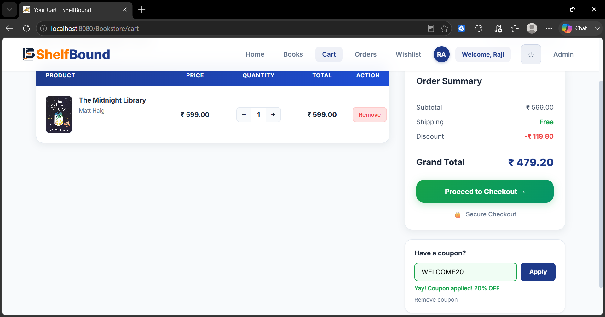

# 📚 ShelfBound — Online Bookstore Web Application

**A full-stack e-commerce bookstore, built from scratch — not from a template brief.**


### 🎥 [Watch the Project Demo]([https://1drv.ms/v/c/99e7c2a67d1ed93e/IQB10BIEI9R_SIQ1LuCKv30yARPwv_haHbQkobzvOF5Pg-A?e=wfwZjb](https://drive.google.com/file/d/1vZL-sO3S1cf9jhZlN2j7xfH868dBIF3k/view?usp=drivesdk))  ·  📊 [View the Project Presentation](presentation/ShelfBound.pptx)

---

## 📖 Project Overview

ShelfBound is a dynamic, responsive online bookstore that simulates a real e-commerce platform end-to-end — not a CRUD demo. It supports full **customer-side shopping workflows** and a **role-secured admin dashboard** for running the store.

Shoppers can browse books by category, manage a wishlist, apply a coupon at checkout, place orders, and track order status. Admins manage inventory, monitor orders, view live platform statistics, and respond to customer messages — all from a dedicated dashboard.

The application is built on the **MVC (Model–View–Controller)** architecture with the **DAO Design Pattern**, keeping business logic, data access, and presentation cleanly separated for maintainability and scale.

> **Why this project is different:** most learners in this batch built a food-delivery clone from a shared brief. ShelfBound was designed and built independently as a bookstore platform — including its own database schema, coupon engine, admin workflows, and branding.

---

## 🚀 Key Features

### 👤 Customer Features

- User Registration, Login & Logout with Session-Based Authentication
- Browse Books Catalog with Category-Based Filtering
- Detailed Book Information Pages
- Persistent, Database-Backed Shopping Cart
- **Coupon Engine** — apply `WELCOME20` for a live 20% discount, synced across cart and checkout
- Wishlist Management
- Checkout with Shipping Address Collection
- Order Placement & Order History
- Real-Time Order Status Tracking (Pending → Shipped → Delivered)
- Contact Admin via a Dedicated Contact Page
- Fully Responsive UI with AJAX (Fetch API) for dynamic, no-reload updates

### 🔐 Authentication & Authorization

- Credentials validated against MySQL-backed user records
- Session management via Java Servlets and `HttpSession`
- Unauthorized access to protected pages auto-redirects to Login
- Role-based access control separating **Customer** and **Admin** capabilities

### 🛒 Cart & Order Management

- Add / update / remove items with database-persistent cart storage
- Coupon discount recalculated live from the current subtotal — never a stale, hardcoded value
- Full checkout → order placement → order tracking workflow

---

## 🛠️ Admin Dashboard

A dedicated, secured Admin Panel for running the store day-to-day.

**📊 Dashboard Analytics** — total users, total books, total orders, and pending-order counts at a glance.

**📚 Book Management** — add, update, and delete books; manage stock and full inventory.

**📦 Order Management** — view customer orders, order details, and update order status through the Pending → Shipped → Delivered workflow.

**💬 Customer Message Management** — every Contact Page submission lands in the Admin Panel for the admin to view, reply to, or delete — enabling direct in-app communication with customers.

---

## 🏗️ Architecture & Design

**MVC Flow**

 Layers:- 

 **Model** -> Java Beans, entity models.
 
 **Controller** -> Java Servlets — request handling, session management, auth logic 
 
 **View** -> JSP, HTML5, CSS3, JavaScript (AJAX for dynamic updates) 

**DAO Design Pattern** separates business logic from database logic — cleaner code, easier testing, and reusable data-access methods across the app.

**Project Structure**

```
com.shelfbound.*
 ├── connection/      → DB connection handling
 ├── dao/ , daoimpl/  → Data access contracts + JDBC implementations
 ├── model/           → Entity / bean classes
 ├── servlet/         → Customer-facing controllers (Cart, Wishlist, Order, ...)
 └── servlet.admin/   → Admin-facing controllers

webapp/
 ├── css/ , js/ , images/ , videos/   → per-page CSS to isolate styling bugs
 ├── customer/        → customer-facing JSP views
 └── WEB-INF/         → web.xml, lib/
```

One servlet per feature (Cart, Wishlist, Order, Admin operations), and per-page CSS instead of one shared stylesheet — a deliberate choice to keep styling bugs isolated to a single page rather than cascading across the app.

---

## 🗄️ Database Design

MySQL, accessed via JDBC with a fully relational, foreign-key-constrained schema — **9 tables** in total.

---

### Schema Overview

- **users** — `user_id` (PK), username, email, password, phone, address, city, state, pincode, created_at  
  → Referenced by: cart, wishlist, orders

- **admin** — `admin_id` (PK), username, password  
  → Standalone

- **categories** — `category_id` (PK), category_name  
  → Referenced by: books

- **books** — `book_id` (PK), `category_id` (FK), title, author, price, stock_qty , image_url, rating , category_id, is_new_arrival, is_popular, created_at
  → Referenced by: cart, wishlist, order_items

- **cart** — `cart_id` (PK), `user_id` (FK), `book_id` (FK), quantity  
  → Links users ↔ books

- **wishlist** — `wishlist_id` (PK), `user_id` (FK), `book_id` (FK), added_at  
  → Links users ↔ books

- **orders** — `order_id` (PK), `user_id` (FK), total_amount, order_status, payment_method, shipping_address, order_date  
  → Parent of order_items

- **order_items** — `order_item_id` (PK), `order_id` (FK), `book_id` (FK), quantity, price  
  → Line items per order

- **contact_messages** — `message_id` (PK), name, email, message, submitted_at, status, admin_reply, replied_at 
  → Standalone — feeds Admin message panel


**Design choices** optimized CRUD operations, `PreparedStatement` usage throughout to prevent SQL injection, and session-aware workflows so cart/wishlist state persists correctly per logged-in user.

---

## 🔍 Engineering Deep-Dive: A Real Bug, Traced and Fixed

**The problem:** when an admin updated an order's status from the Manage Orders panel, the change didn't reliably show up on the customer's My Orders page — the status the customer saw lagged behind what the admin had just set.

**The fix:** traced the bug to the order list being served from a stale query result within the same request cycle as the update. The flow was split so `AdminOrderServlet` handles the status **update**, then issues a **redirect** (not a forward) back to the orders view. The redirect forces a fresh `GET` + fresh `SELECT`, so both the admin and customer views always read the current row from the database — a textbook **Post/Redirect/Get** fix for a stale-read bug.

---

## ✨ Under-the-Hood Highlight: Coupon Discount Logic

Applying `WELCOME20` recalculates subtotal, discount, and grand total in a single pass, kept in sync across the cart and checkout pages:

```java
// CartServlet — applyCoupon()
double subtotal = cartDao.getSubtotal(userId);
String coupon = request.getParameter("coupon");
double discount = 0.0;

if ("WELCOME20".equalsIgnoreCase(coupon)) {
    discount = subtotal * 0.20;
} else {
    session.setAttribute("couponError", "Invalid or expired code");
}

double shipping = 0.0; // free shipping, always
double grandTotal = subtotal - discount + shipping;

session.setAttribute("discount", discount);
session.setAttribute("grandTotal", grandTotal);
response.sendRedirect("cart");
```

- **Single source of truth** — the discount is recomputed from the *live* subtotal, not stored as a fixed value, so it stays correct even if the cart quantity changes after the coupon is applied.
- **Session-scoped** — discount and grand total live in session, so cart and checkout always render identical numbers without recalculating twice.
- **Verified against the UI** — ₹1198 subtotal × 20% = ₹239.60 discount, matching exactly what renders on the cart and checkout screens.

---

## 🛠️ Technology Stack

- **Language:** Java (Jakarta EE)
- **Architecture:** MVC + DAO Pattern
- **Backend:** Servlets, JSP, JDBC
- **Database:** MySQL (9 relational tables, FK constraints)
- **Server:** Apache Tomcat 10
- **Frontend:** HTML5, CSS3, JavaScript, AJAX (Fetch API)
- **Build Tool:** Maven
- **IDE:** Eclipse


---

## 🎨 Branding & User Experience

- Custom ShelfBound logo and brand identity
- Dynamic, responsive UI with interactive notifications and popups
- Professional, analytics-driven admin dashboard
- User-friendly navigation across a modern e-commerce layout

All branding assets are custom-created and integrated into the application.

---

## 🤖 AI-Assisted Development Workflow

Modern AI tools were used to accelerate development and improve design quality:

- **Claude** — UI/UX refinement and interface improvement suggestions
- **Canva AI** — custom logo design
- **DesignArena AI** — hero section visual design and creative asset generation

All application architecture, database design, business logic, integration, testing, debugging, and deployment were independently designed and implemented by the project author.

---

## 📸 Project Screenshots

### 🏠 Home Page


---

## 👤 Customer Module

### 🔐 Customer Login Page


### 📝 Customer Register Page


### 📚 Books Page


### 📖 Book Details Page


### ❤️ Wishlist Page


### 🛒 Cart Page


### 💳 Checkout Page


### 📦 Orders Page


### 📦 Order Details Page


### OrderSuccess Page


### 📩 Contact Page


### Profile Page


---

## 🛠️ Admin Module

### 🔐 Admin Login Page


### 📊 Admin Dashboard


### 📚 Manage Books


### 📦 Manage Orders


### 🧾 Manage Messages


---

## ℹ️ About Page


---

## 🔮 Future Enhancements

### 1. 🗺️ Live Order Tracking Map
Real-time delivery progress shown on a navigation-style map from dispatch to doorstep.

### 2. 🔑 OTP Verification
Phone/email OTP at registration, login, and checkout for stronger identity verification.

### 3. 💳 Online Payment Gateway
Real card / UPI payments alongside the current Cash-on-Delivery flow.

### 4. 📧 Email Notifications
Admin replies and order-status updates sent directly to the user's registered email.

### 5. 🎁 Per-Book Admin Customization & Offers
Admin-configurable discounts, promotional tags, and limited-time offers from the Manage Books panel.

### 6. ⭐ AI-Based Book Recommendations
Personalized suggestions based on browsing and purchase history.

### 7. 📝 Review & Rating System
Customer reviews and star ratings on book detail pages.

### 8. ☁️ Cloud Deployment
Move the app off local Tomcat to a cloud-hosted environment.

### 9. 📱 Mobile App + Play Store Deployment
Native mobile companion app for shopping and order tracking.

### 10. 📈 Advanced Analytics Dashboard
Deeper sales, inventory, and customer-behavior insights for admins.

---

## 👩‍💻 Developer Info

- **Project Type:** Individual Project
- **Domain:** Full Stack Java Web Development
- **Focus:** E-commerce + Backend Architecture

**Rajyalakshmi Devarala**
   
  B.Tech, Electronics and Communication Engineering

**Passionate about:**
- Java Full Stack Development
- Web Application Development
- Database Management Systems
- Software Engineering & Backend Development
- AI-Assisted Product Development

---

## ⭐ Repository Support

If you found this project useful, consider giving the repository a star — it helps increase visibility and supports future development.

⭐ **Star the repository if you like the project.**
